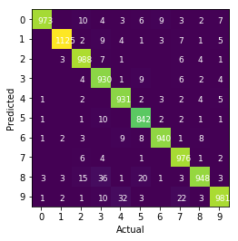
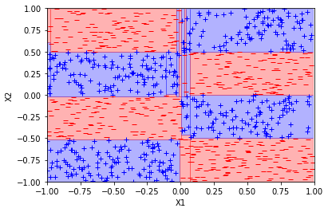
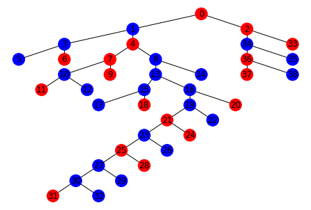

# MLModels
Homemade implementations of many common ML models, including neural nets, linear models, and decision trees.

# Highlights
## MNIST benchmark

### Imports / get data

```python
import numpy as np
np.random.seed(0)
import matplotlib.pyplot as plt
%matplotlib inline
from functools import reduce

import neuralNet as nn
import utils as u
from torchvision import datasets # Only to get MNIST data
```

```python
train_dataset = datasets.MNIST('./data', train=True, download=True)
test_dataset = datasets.MNIST('./data', train=False, download=True)
X = train_dataset.data.numpy()
Y = train_dataset.targets.numpy()
tX = test_dataset.data.numpy()
tY = test_dataset.targets.numpy()

X = X.reshape([X.shape[0], -1]).astype(np.float64)
tX = tX.reshape([tX.shape[0], -1]).astype(np.float64)
Y = u.onehot(Y)
tY = u.onehot(tY)
```
### Actually train the model

```python
w_init = 0.01 # scaling factor for random weight initialization
eta = 1e-4 # learning rate
clf = nn.NeuralNet(sizes=[X.shape[1], 100, 10], eta=eta, loss='categorical', nonLin=['relu','softmax'],
                     w_init = w_init)
it, E_ins = clf.fit(X, Y, maxIters=3, trackE_in=True, print_stuff=True)
```

    Epoch 1: training loss = 0.16066723965571167
    Epoch 2: training loss = 0.1052463424645151
    Epoch 3: training loss = 0.09352130282334954


```python
preds = clf(tX)
grid = u.confusions(preds, tY).astype(int)
u.plot_confusions(grid)
print(f'Accuracy: {1 - u.error_rate(preds, tY)}')
```

    Accuracy: 0.9634




## Decision Trees with visualization

```python
import numpy as np 
np.random.seed(0) # 0 ok
import matplotlib.pyplot as plt 
import networkx as nx
from networkx.drawing.nx_agraph import graphviz_layout as tree_layout

import utils as u
from decisionTrees import DecisionTree
```

```python
f = lambda x: (np.floor(1 * x[0]) + np.floor(2 * x[1])) % 2
X, Y = u.genData(f, 1000, appendOnes=False)
d = DecisionTree()
d.fit(X, Y, maxNodes=50)

ax = plt.subplot(111)
ax.set_xlim(-1, 1)
ax.set_ylim(-1, 1)
d.quickPlot(X, Y, axis=ax)
# Visualize the decision boundaries
```





```python
g = d.to_networkx()
pos=tree_layout(g, prog='dot')
colors = ['b' if n['value'] == 1 else 'r' for _, n in g.nodes(data=True)]
nx.draw(g, pos, with_labels=True, arrows=False, node_color=colors)
# Visualize the tree
```





# Files

## Notebooks
1. demo.ipynb is an overview of the functionality of this package, shows training, prediction, and visualization of many of the models / demonstrates the consistent API used throughout
2. deep_learning.ipynb shows usage of the deep learning framework, and a feedforward neural net's performance on the MNIST dataset, as well as the usage of these nets to fit a variety of other functions

## Other Files
1. linearModels.py -- a generic linear model using closed form least squares solution for squared loss is the superclass, perceptron, logistic regression are all subclasses. SVM's soon to be added!
2. decisionTrees.py -- decision tree implementation for both classification / regression, along with tools for tree visualization. AdaBoost / GradientBoosting soon to be added!
3. neuralNet.py -- neural net implementation, convolutional layers / more activation and loss functions soon to be added!
4. utils.py -- utilities for generating data / linear functions / data processing / decision boundary visualization

